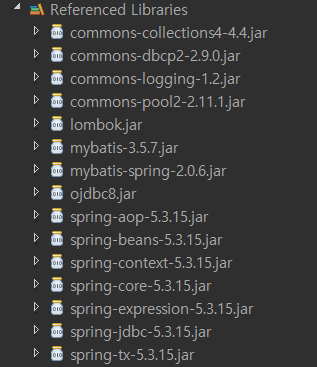
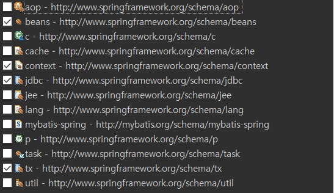

<h1>Spring 과 Mybatis 연동하기</h1>
<ol>
<li>
    *.jar 및 Maven URL 준비
</li>



<li>
    applicationContext.xml 파일 준비 (설정파일)  
</li>
     <br>
    
<li>
   mybatis-config.xml 생성
</li>
mybatis pdf 파일 3page<br>

<li>
   Mybatis 에 Spring 추가되며 다른점은 
   <br>
   -Connetion Pool (Spring 에서 구현)
   <br>
   -Mapper (Spring 또는 Mybatis)
   <br>
   -typeAlias (Mybatis)
</li>

</ol>


<br><br><br>

```ruby
<?xml version="1.0" encoding="UTF-8"?>
<beans xmlns="http://www.springframework.org/schema/beans"
	xmlns:xsi="http://www.w3.org/2001/XMLSchema-instance"
	xmlns:context="http://www.springframework.org/schema/context"
	xmlns:jdbc="http://www.springframework.org/schema/jdbc"
	xmlns:tx="http://www.springframework.org/schema/tx"
	xsi:schemaLocation="http://www.springframework.org/schema/jdbc http://www.springframework.org/schema/jdbc/spring-jdbc-4.3.xsd
		http://www.springframework.org/schema/beans http://www.springframework.org/schema/beans/spring-beans.xsd
		http://www.springframework.org/schema/context http://www.springframework.org/schema/context/spring-context-4.3.xsd
		http://www.springframework.org/schema/tx http://www.springframework.org/schema/tx/spring-tx-4.3.xsd">
	<!-- Connection Pool & DataSource -->
	<context:property-placeholder location="classpath:spring/db.propertise" />   <!-- db 설정파일 위치 -->
	
	<bean id="dataSource" class="org.apache.commons.dbcp2.BasicDataSource">		 <!-- 설정파일에 저장된 정보불러오기-->
		<property name="driverClassName" value="${jdbc.driver}"></property>
		<property name="url" value="${jdbc.url}"></property>
		<property name="username" value="${jdbc.username}"></property>
		<property name="password" value="${jdbc.password}"></property>
	</bean>
</beans>
```