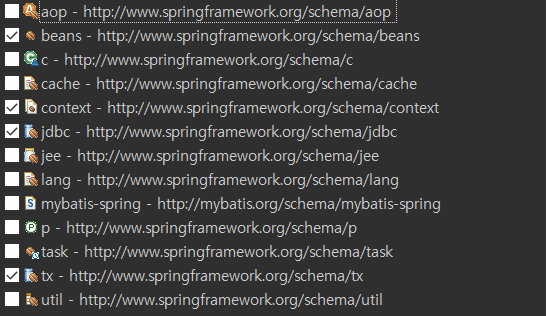
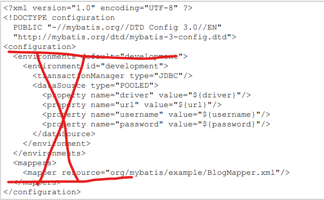

<h1>Spring 과 Mybatis 연동하기</h1>
<ol>
<li>
    *.jar 및 Maven URL 준비 !
</li>

<li>
    applicationContext.xml 파일 준비 (설정파일)  
</li>

    
 
    
<li>
   mybatis-config.xml 생성
</li>
mybatis pdf 파일 3page 

<li>
   Mybatis 에 Spring 추가되며 다른점은 
    
   -Connetion Pool (Spring 에서 구현)
    
   -Mapper (Spring 또는 Mybatis)
    
   -typeAlias (Mybatis)
</li>

</ol>

   

<strong>-applicationContext.xml</strong>

<table class="colorscripter-code-table" style="margin:0;padding:0;border:none;background-color:#272727;border-radius:4px;" cellspacing="0" cellpadding="0"><tr><td style="padding:6px;border-right:2px solid #4f4f4f">

1

2

3

4

5

6

7

8

9

10

11

12

13

14

15

16

17

18

19

20

21

22

23

24

25

26

27

28

29

30

31

32

33

34

35

36

37

38

39

40

41

42

43

44

45

</td><td style="padding:6px 0;text-align:left">

&lt;?xml&nbsp;version="1.0"&nbsp;encoding="UTF-8"?&gt;

&lt;beans&nbsp;xmlns="http://www.springframework.org/schema/beans"

&nbsp;&nbsp;&nbsp;&nbsp;xmlns:xsi="http://www.w3.org/2001/XMLSchema-instance"

&nbsp;&nbsp;&nbsp;&nbsp;xmlns:context="http://www.springframework.org/schema/context"

&nbsp;&nbsp;&nbsp;&nbsp;xmlns:jdbc="http://www.springframework.org/schema/jdbc"

&nbsp;&nbsp;&nbsp;&nbsp;xmlns:tx="http://www.springframework.org/schema/tx"

&nbsp;&nbsp;&nbsp;&nbsp;xsi:schemaLocation="http://www.springframework.org/schema/jdbc&nbsp;http://www.springframework.org/schema/jdbc/spring-jdbc-4.3.xsd

&nbsp;&nbsp;&nbsp;&nbsp;&nbsp;&nbsp;&nbsp;&nbsp;http://www.springframework.org/schema/beans&nbsp;http://www.springframework.org/schema/beans/spring-beans.xsd

&nbsp;&nbsp;&nbsp;&nbsp;&nbsp;&nbsp;&nbsp;&nbsp;http://www.springframework.org/schema/context&nbsp;http://www.springframework.org/schema/context/spring-context-4.3.xsd

&nbsp;&nbsp;&nbsp;&nbsp;&nbsp;&nbsp;&nbsp;&nbsp;http://www.springframework.org/schema/tx&nbsp;http://www.springframework.org/schema/tx/spring-tx-4.3.xsd"&gt;

&nbsp;

&nbsp;&nbsp;&nbsp;&nbsp;&lt;!--&nbsp;Connection&nbsp;Pool&nbsp;&amp;&nbsp;DataSource&nbsp;--&gt;

&nbsp;&nbsp;&nbsp;&nbsp;&lt;context:property-placeholder&nbsp;location="classpath:spring/db.properties"&nbsp;/&gt;

&nbsp;&nbsp;&nbsp;&nbsp;&lt;tx:annotation-driven&nbsp;transaction-manager="transactionManager"/&gt;

&nbsp;&nbsp;&nbsp;&nbsp;

&nbsp;&nbsp;&nbsp;&nbsp;&lt;bean&nbsp;id="dataSource"&nbsp;class="org.apache.commons.dbcp2.BasicDataSource"&gt;

&nbsp;&nbsp;&nbsp;&nbsp;&nbsp;&nbsp;&nbsp;&nbsp;&lt;property&nbsp;name="driverClassName"&nbsp;value="${jdbc.driver}"&gt;&lt;/property&gt;

&nbsp;&nbsp;&nbsp;&nbsp;&nbsp;&nbsp;&nbsp;&nbsp;&lt;property&nbsp;name="url"&nbsp;value="${jdbc.url}"&gt;&lt;/property&gt;

&nbsp;&nbsp;&nbsp;&nbsp;&nbsp;&nbsp;&nbsp;&nbsp;&lt;property&nbsp;name="username"&nbsp;value="${jdbc.username}"&gt;&lt;/property&gt;

&nbsp;&nbsp;&nbsp;&nbsp;&nbsp;&nbsp;&nbsp;&nbsp;&lt;property&nbsp;name="password"&nbsp;value="${jdbc.password}"&gt;&lt;/property&gt;

&nbsp;&nbsp;&nbsp;&nbsp;&lt;/bean&gt;

&nbsp;&nbsp;&nbsp;&nbsp;

&nbsp;&nbsp;&nbsp;&nbsp;&lt;!--&nbsp;SqlSessionFactory&nbsp;--&gt;

&nbsp;&nbsp;&nbsp;&nbsp;&lt;bean&nbsp;id="sqlSessionFactory"&nbsp;class="org.mybatis.spring.SqlSessionFactoryBean"&gt;

&nbsp;&nbsp;&nbsp;&nbsp;&nbsp;&nbsp;&nbsp;&nbsp;&lt;property&nbsp;name="configLocation"&nbsp;value="classpath:spring/mybatis-config.xml"&gt;&lt;/property&gt;

&nbsp;&nbsp;&nbsp;&nbsp;&nbsp;&nbsp;&nbsp;&nbsp;&lt;property&nbsp;name="dataSource"&nbsp;ref="dataSource"&gt;&lt;/property&gt;

&nbsp;&nbsp;&nbsp;&nbsp;&nbsp;&nbsp;&nbsp;&nbsp;&lt;property&nbsp;name="mapperLocations"&nbsp;value="classpath:user/dao/userMapper.xml"&gt;&lt;/property&gt;

&nbsp;&nbsp;&nbsp;&nbsp;&lt;/bean&gt;

&nbsp;&nbsp;&nbsp;&nbsp;&lt;!--&nbsp;SqlSession&nbsp;--&gt;

&nbsp;&nbsp;&nbsp;&nbsp;&lt;bean&nbsp;id="sqlSession"&nbsp;class="org.mybatis.spring.SqlSessionTemplate"&gt;

&nbsp;&nbsp;&nbsp;&nbsp;&nbsp;&nbsp;&nbsp;&nbsp;&lt;constructor-arg&nbsp;ref="sqlSessionFactory"&gt;&lt;/constructor-arg&gt;

&nbsp;&nbsp;&nbsp;&nbsp;&lt;/bean&gt;

&nbsp;&nbsp;&nbsp;&nbsp;&lt;!--&nbsp;Transaction&nbsp;--&gt;

&nbsp;&nbsp;&nbsp;&nbsp;&lt;bean&nbsp;id="transactionManager"&nbsp;class="org.springframework.jdbc.datasource.DataSourceTransactionManager"&gt;&nbsp;&lt;!--&nbsp;commit,close&nbsp;--&gt;

&nbsp;&nbsp;&nbsp;&nbsp;&nbsp;&nbsp;&nbsp;&nbsp;&lt;constructor-arg&nbsp;ref="dataSource"&gt;&lt;/constructor-arg&gt;&nbsp;

&nbsp;&nbsp;&nbsp;&nbsp;&lt;/bean&gt;

&nbsp;&nbsp;&nbsp;&nbsp;

&nbsp;&nbsp;&nbsp;&nbsp;&lt;bean&nbsp;id="userDAOMybatis"&nbsp;class="user.dao.UserDAOMybatis"&gt;&nbsp;&nbsp;&nbsp;&nbsp;&lt;!--&nbsp;userDAOMybatis.xml&nbsp;파일을&nbsp;경유&nbsp;--&gt;

&nbsp;&nbsp;&nbsp;&nbsp;&nbsp;&nbsp;&nbsp;&nbsp;&lt;property&nbsp;name="sqlSession"&nbsp;ref="sqlSession"&gt;&lt;/property&gt;

&nbsp;&nbsp;&nbsp;&nbsp;&lt;/bean&gt;

&lt;/beans&gt;

&nbsp;

&nbsp;

&nbsp;

&nbsp;

<a href="http://colorscripter.com/info#e" target="_blank" style="color:#4f4f4ftext-decoration:none">Colored by Color Scripter</a>
</td><td style="vertical-align:bottom;padding:0 2px 4px 0"><a href="http://colorscripter.com/info#e" target="_blank" style="text-decoration:none;color:white">cs</a></td></tr></table>

 
<strong>-db.properties</strong>

<table class="colorscripter-code-table" style="margin:0;padding:0;border:none;background-color:#272727;border-radius:4px;" cellspacing="0" cellpadding="0"><tr><td style="padding:6px;border-right:2px solid #4f4f4f">

1

2

3

4

</td><td style="padding:6px 0;text-align:left">

jdbc.driver=oracle.jdbc.driver.OracleDriver

jdbc.url=jdbc:oracle:thin:@localhost:1521:xe

jdbc.username=c##java

jdbc.password=oracle

</td><td style="vertical-align:bottom;padding:0 2px 4px 0"><a href="http://colorscripter.com/info#e" target="_blank" style="text-decoration:none;color:white">cs</a></td></tr></table>

